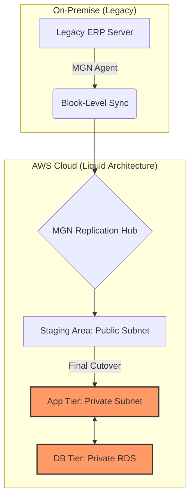

# TECHNICAL ARCHITECTURE: WAKWETU HYBRID TOPOLOGY

## 1. High-Level Design (Mermaid Diagram)
Below is the logical flow of the migration path from Legacy On-Premise to the Liquid AWS Cloud.

## 2. Component Breakdown
- **Network:** VPC (10.0.0.0/16) with Multi-AZ isolation.
- **Compute:** EC2 t3.medium (Pilot) running Amazon Linux 2023.
- **Persistence:** RDS PostgreSQL 17.6 (Post-Migration Target).
- **Security:** Security Group ingress restricted to internal VPC traffic (Port 5432).
